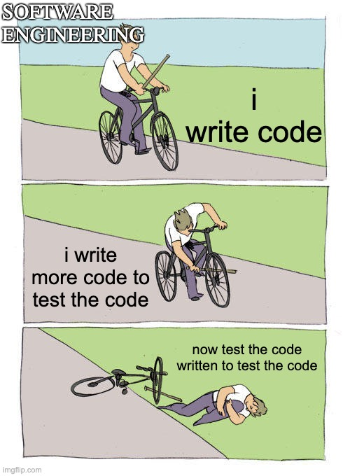

# Ishan's User Page

## Introduction

Hi, my name is Ishan! I'm a software engineering student passionate about AI and data analysis. In my spare time, I enjoy exploring new technologies and working on personal projects.

### About Me

- **Interests:** AI, Machine Learning, Data Science
- **Hobbies:** Coding, Reading, Hiking
- **Favorite Quote:**
  > "Yesterday is history, tomorrow is a mystery, but today is a gift." - Oogway

### Programming Skills

- Python
- C++
- Java
- Flutter
  
Want to know my favorite programming language? click [here](README.md) to find out!

## My Projects

***Here are some of the projects I've worked on:***

1. AI chatbot for healthcare
2. Data analysis toolkit in Python
3. Predictive models for market trends

## Code Snippet

Here's a code snippet I'm proud of:

```cpp
// FastSaga iterator example in C++
Iterator begin() {
    return Iterator(this, 0);
}

Iterator end() {
    return Iterator(this, size);
}
```

## Links

**Linkedin:**[LinkedIn](https://www.linkedin.com/in/ishanvaish/)

**In the News:**[News](https://gulfnews.com/friday/art-people/this-dubai-student-is-building-an-app-to-teach-kids-new-skills-1.2311313)

## Tasks I still need to finish

- [x] Complete Markdown User Page for CSE 110
- [x] Complete CSE 101 HW
- [ ] Apply for internships

## Image


[Back to top](#Introduction)
